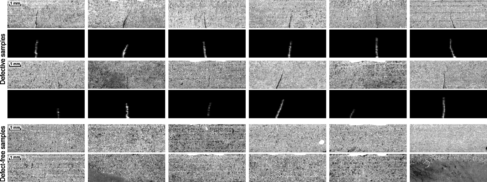

# Kolektor Surface-Defect Dataset



## The Dataset


The dataset is constructed from images of defected electrical commutators that were provided and annotated by Kolektor Group d.o.o.. Specifically, microscopic fractions or cracks were observed on the surface of the plastic embedding in electrical commutators. The surface area of each commutator was captured in eight non-overlapping images. The images were captured in a controlled environment.

The dataset consists of:

1. 50 physical items (defected electrical commutators)
2. 8 surfaces per item
3. Altogether 399 images: 52 images of visible defect, 347 images without any defect
4. Original images of sizes: width: 500 px, height: from 1240 to 1270 px
5. For training and evaluation images should be resized to 512 x 1408 px

For each item the defect is only visible in at least one image, while two items have defects on two images, which means there were 52 images where the defects are visible. The remaining 347 images serve as negative examples with non-defective surfaces.

## Download dataset
We split the dataset into three folds to perform 3-fold cross validation. The splits are available at [KolektorSDD-training-splits.zip](./weights/pretrained.th).


## Pretrained model
If you want to test the performance of our baseline, please use the [pretrained model](https://drive.google.com/file/d/1jcsmxZHL6DGwDplLp93H4VeN2ZjqBsOF/view?usp=sharing).

## Usage

```shell
    python3 train.py
    python3 test.py
```

The code requires NumPy and Pillow to work correctly.

## Citing

If you use this dataset in scientific context, please cite the following
publications:

  
```bibtex

@article{Tabernik2019JIM,
  author = {Tabernik, Domen and {\v{S}}ela, Samo and Skvar{\v{c}}, Jure and 
  Sko{\v{c}}aj, Danijel},
  journal = {Journal of Intelligent Manufacturing},
  title = {{Segmentation-Based Deep-Learning Approach for Surface-Defect Detection}},
  year = {2019},
  month = {May},
  day = {15},
  issn={1572-8145},
  doi={10.1007/s10845-019-01476-x}
}
```
